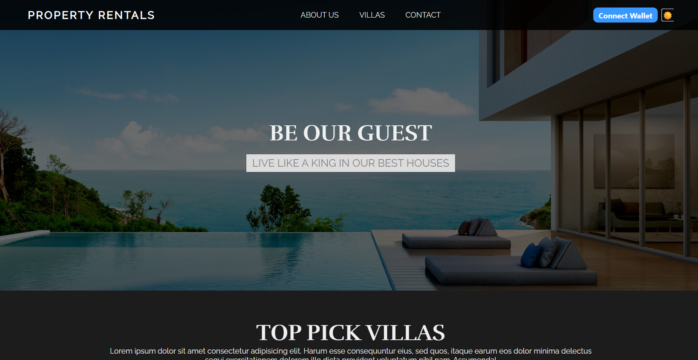
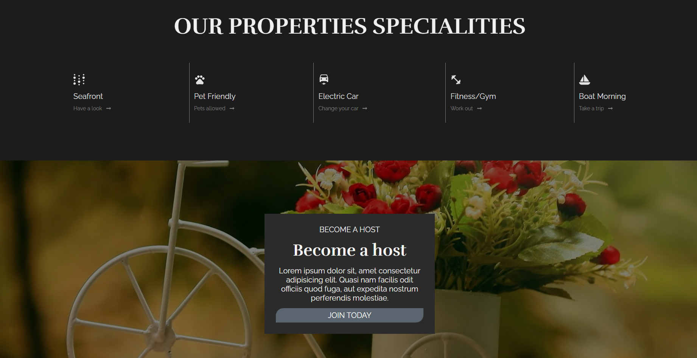
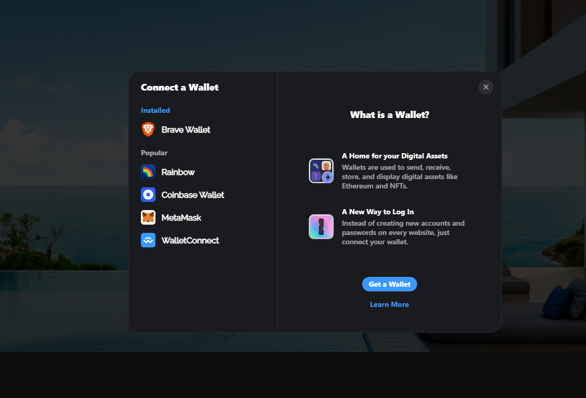

# totality-frontend-challenge

- In this challenge, I developed a website Property Rental Platform using React.js. This is a single-page application.
- In this project, I used `react-router-dom` for performing dynamic routing in the React.js web app.
- Packages used: `react-router-dom` and `react-icons`.
- Used `slice` and `map` methods to achieve desired elements from an array.
- Created a website with multiple containers and content tags.
- Separate components for website sections.
- Converted string format ID to numeric format and filtered luxury villas.
- Designed custom maps.

## Screenshots

### Home Page

### Villas Page

### Contact Page

